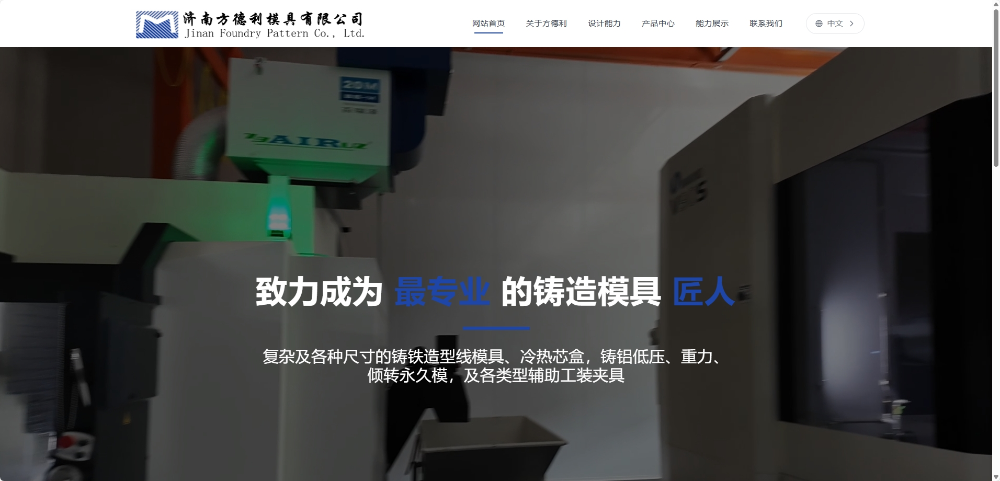

<div align="center">
  <h1>济南方德利模具有限公司官网</h1>
  
  <p>
    <a href="https://xqqcylh6780.github.io/jinan-foundry-pattern-dev/" target="_blank">
      
    </a>
  </p>

  <p>
    
    
    
    
  </p>
</div>

## ✨ 项目简介

<p align="center">
  
</p>

济南方德利模具有限公司官方网站，专注于展示公司的产品、服务和技术优势。

### 🎯 主要功能
- 📱 响应式设计，完美适配各种设备
- 🖼️ 产品展示与分类浏览
- 🏢 公司介绍与发展历程
- 📍 联系方式与地理位置
- 🚀 优化的加载性能

## 🛠️ 技术栈

- **前端框架：** Vue 3 + TypeScript
- **构建工具：** Vite
- **CSS 框架：** Tailwind CSS
- **UI 组件：** Element Plus
- **状态管理：** Vue Router
- **开发工具：** VS Code + Volar

## 💻 本地开发

### 环境要求
- Node.js 16.0 或更高版本
- npm 7.0 或更高版本

### 安装和运行

```bash
## 克隆项目
git clone https://github.com/xqqcylh6780/jinan-foundry-pattern-dev.git
## 进入项目目录
cd jinan-foundry-pattern-dev
## 安装依赖
npm install
## 启动开发服务器
npm run dev
## 构建生产版本
npm run build
```

## 📱 功能特点
- 响应式设计，支持各种设备访问
- 产品展示与分类浏览
- 公司介绍与联系方式
- 图片懒加载优化
- 平滑的页面过渡效果

## 🚀 部署状态
[](https://github.com/xqqcylh6780/jinan-foundry-pattern-dev/actions/workflows/static.yml)

## 📂 项目结构

## 🤝 贡献指南
1. Fork 本仓库
2. 创建特性分支 (`git checkout -b feature/AmazingFeature`)
3. 提交更改 (`git commit -m 'Add some AmazingFeature'`)
4. 推送到分支 (`git push origin feature/AmazingFeature`)
5. 提交 Pull Request

## 📄 许可证
[MIT License](LICENSE)

### 扫码添加微信

